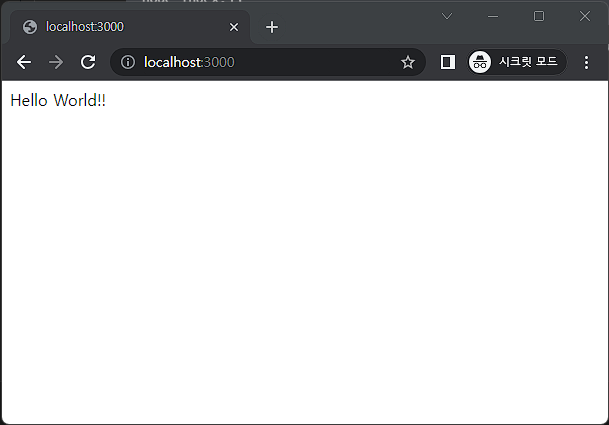

# 웹 기초 이해

> 웹을 이해하기 위해서는 우선 HTTP와 HTTPS, 클라이언트/서버 아키텍처, 그리고 TCP/IP에 대한 기본적인 이해가 필요함

<br/>

## HTTP와 HTTPS

- HTTP(Hypertext Transfer Protocol)는 웹에서 정보를 주고 받는 프로토콜. 
- 클라이언트가 서버에 페이지나 데이터를 요청하면, 서버는 해당 요청에 대한 응답을 HTTP를 통해 보냄
- HTTPS(Hypertext Transfer Protocol Secure)는 기본적으로 HTTP와 같지만, 데이터를 전송할 때 SSL/TLS 프로토콜을 이용해 데이터를 암호화하는 점이 다름
- 이로 인해 중간에서 데이터를 가로채더라도 이해할 수 없게 되어, 보안이 강화 됨

## 클라이언트/서버 아키텍처

- 클라이언트/서버 아키텍처는 웹의 기본적인 구조.
- 클라이언트(일반적으로 웹 브라우저)는 서버에 페이지나 데이터를 요청하고, 서버는 요청받은 정보를 클라이언트에 전달

## TCP/IP

- TCP/IP(Transmission Control Protocol/Internet Protocol)는 인터넷에서 데이터를 주고 받는 데 사용되는 주요 프로토콜.
- TCP는 데이터를 패킷으로 나누어 인터넷을 통해 전송하고, IP는 이 패킷들이 정확한 목적지에 도착하도록 함

<br/>

# 실습

- 간단한 웹 서버를 만들어 보기! 
- Node.js와 Express를 사용하여 실습 진행
- Node.js 설치: Node.js의 공식 웹사이트에서 Node.js를 설치 (https://nodejs.org/)

<br/>

- 새로운 폴더(ws_basic)를 만들고 그 안에서 npm init 명령어를 실행하여 새로운 Node.js 프로젝트를 시작
  ```
  npm init -y
  ```

-  Express 패키지 설치
    ```
    npm install express
    ```
- index.js 파일을 생성하고 코드를 입력
  ```
  // Express 모듈을 불러오기
  const express = require('express');

  // Express 애플리케이션을 생성
  const app = express();

  // 웹 서버가 실행될 포트를 정의
  const port = 3000;

  // HTTP GET 요청을 루트('/') 경로로 처리
  // 브라우저에서 http://localhost:3000 으로 접속하면 이 부분이 실행 됨
  app.get('/', (req, res) => {
    // 응답으로 'Hello World!!' 문자열을 전송
    res.send('Hello World!!');
  });

  ```

  > 이 코드는 HTTP GET 요청을 루트 경로('/')로 처리하는 간단한 웹 서버를 생성.

<br/>

- node index.js를 실행하여 서버를 시작
  ```
  node index.js
  ```

- 웹 브라우저에서 http://localhost:3000을 입력하여 접속하면 'Hello World!!' 메시지를 확인 할 수 있음

  