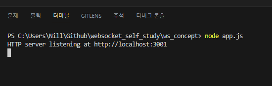
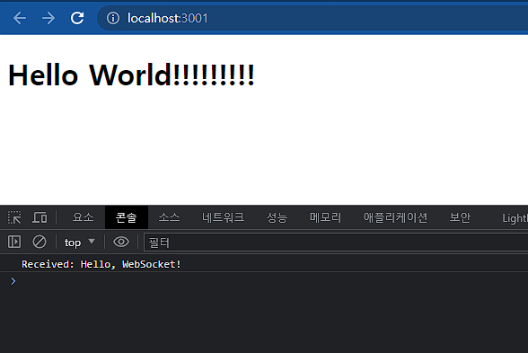
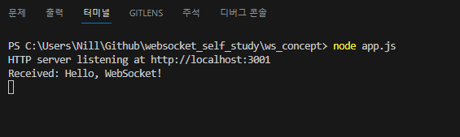

# 웹소켓 개념 이해

- 웹소켓은 실시간으로 양방향 통신을 가능하게 하는 웹 통신 기술
- HTTP와는 달리, 웹소켓은 서버와 클라이언트 간에 `영구적인 연결을 유지`하며, `양방향 통신`이 가능

## 웹소켓이란?

- 웹소켓은 한 번 연결되면 연결이 끊어질 때까지 계속 연결을 유지하는 특성을 가지고 있음 
- 이 특성으로 인해 서버는 클라이언트에게 `실시간으로 데이터를 전송`할 수 있음

## 웹소켓의 필요성

- 기존의 HTTP 통신 방식에서는 클라이언트가 서버에 요청을 보내고, 서버가 그 요청에 대한 응답을 보내는 방식이었음
- 이는 서버에서 새로운 데이터가 발생했을 때, 클라이언트가 그 정보를 얻기 위해서는 주기적으로 서버에 요청을 보내야 했는데 이를 `폴링(polling)`이라고 함
- `웹소켓`을 이용하면 서버에서 클라이언트로 `실시간으로 데이터를 전송`할 수 있으므로, 클라이언트가 주기적으로 서버에 요청을 보낼 필요가 없어짐 
- 이로 인해 `실시간 애플리케이션의 효율성`이 크게 `향상` 됨

## 웹소켓의 장점과 한계

- `장점`: 
  - 웹소켓의 가장 큰 장점은 실시간 양방향 통신이 가능하다는 것
  - 이로 인해 실시간 채팅, 게임, 실시간 데이터 피드 등 많은 애플리케이션에서 활용

- `한계`:
  - 웹소켓의 한계는 HTTP보다 복잡하고, HTTP 기반의 기존 인프라(캐싱, 프록시 등)를 그대로 활용하기 어려움
  - 웹소켓 연결을 유지하기 위한 오버헤드도 고려해야 함

<br/>

# 실습

## WS모듈을 사용하여 웹소켓 서버를 생성하기

<br/>

1. Node.js 프로젝트 생성

   ```
   npm init -y
   ```
2. `ws` 모듈 설치

   ```
   npm install ws
   ```
3. `ws` 모듈을 사용하여 `웹소켓 서버`를 `생성`하는 코드를 작성 / `server.js` 파일 생성하기
   ```
   // server.js

   // `ws` 모듈 불러오기
   const WebSocket = require('ws');

   // WebSocket.Server 생성자를 이용해 웹소켓 서버를 생성하고, 이를 'server' 변수에 할당
   // 이 서버는 8080 포트에서 수신 대기중
   const server = new WebSocket.Server({ port: 8080 });
   
   // 'server'에 'connection' 이벤트 리스너를 추가
   // 새로운 클라이언트가 서버에 연결되면 이 이벤트 리스너가 호출 됨
   // 이때 콜백 함수의 첫 번째 인자 'ws'는 연결된 웹소켓을 나타냄
   server.on('connection', ws => {
      // 각 웹소켓에 'message' 이벤트 리스너를 추가
      // 클라이언트가 메시지를 보내면 이 리스너가 호출 됨
      // 콜백 함수의 첫 번째 인자 'message'는 수신한 메시지를 나타냄
      ws.on('message', message => {
        // 콘솔에 수신한 메시지를 출력 함
        console.log('Received: %s', message);
      });

      // 클라이언트에게 'Hello, WebSocket!' 메시지를 보냄
      ws.send('Hello, WebSocket!');
    });

   ``` 
   - 웹소켓 서버를 생성하고, 클라이언트와의 연결을 관리
   - 클라이언트가 메시지를 보내면 이를 콘솔에 출력하고, 클라이언트에게 'Hello, WebSocket!' 메시지를 보냄

<br/>

4. 생성한 `서버`를 `실행`
   
    ```
    node server.js
    ```

     - 이제 웹소켓 서버가 8080 포트에서 실행 중임 
     - 클라이언트에서 이 서버로 웹소켓 연결을 생성하면, 'Hello, WebSocket!' 메시지를 보낼 수 있음
     - 위에 작성한 코드는 서버 측의 코드이며, 실제로 웹소켓 통신을 확인하려면 클라이언트 측에서 웹소켓 연결을 생성해야 함

<br/>

5. `클라이언트`(웹페이지) 생성 / `index.html` 파일 생성하기

   ```
    // index.html

    <!DOCTYPE html>
    <html>
    <body>
    <script>
      // 'ws://localhost:8080' 주소로 웹소켓 연결을 생성
      // 이 연결은 서버에 대한 참조를 나타내며, 서버와의 통신을 관리
      const socket = new WebSocket('ws://localhost:8080');

      // 웹소켓이 열릴 때 호출되는 이벤트 핸들러를 설정
      // 연결이 성공적으로 열리면, 'Hello, WebSocket!' 메시지를 서버에 보냄
      socket.onopen = function() {
        socket.send('Hello, WebSocket!');
      };

      // 서버로부터 메시지를 받을 때 호출되는 이벤트 핸들러를 설정
      // 이때, 'event.data'는 수신한 메시지를 나타냄
      socket.onmessage = function(event) {
        console.log('Received: ' + event.data);
      };

      // 연결에서 오류가 발생할 때 호출되는 이벤트 핸들러를 설정
      // 이때, 'error.message'는 오류 메시지를 나타냄
      socket.onerror = function(error) {
        console.log('Error: ' + error.message);
      };
    </script>
    </body>
    </html>

   ```
   -  웹 브라우저에서 웹소켓 연결을 생성하고, 서버와 통신
   -  서버로 메시지를 보내고, 서버로부터 메시지를 받아 콘솔에 출력
   -  연결에서 발생하는 오류를 콘솔에 출력

<br/>

# 문제점 발견

### 위와 같이 실습을 진행하면 서버는 동작을 하지만 클라이언트에서 에러메시지가 발생함

  - Error 1:  
    - `GET http://localhost:8080/favicon.ico 426 (Upgrade Required)`
  - Error 2:  
    - `GET http://localhost:8080/ 426 (Upgrade Required)`

### 문제가 발생한 원인은? 
   - 웹소켓 서버가 일반적인 HTTP 요청을 처리하지 않기 때문
   - 웹소켓 서버는 웹소켓 프로토콜을 이용한 요청만 처리
   - 따라서 웹소켓 서버는 HTTP GET 요청을 받으면 426 응답을 보내고, 클라이언트가 프로토콜을 업그레이드해야 함을 알리게 됨

### 문제 해결 방법은?
   - 웹페이지를 불러올 수 있는 일반 HTTP 서버와 웹소켓 서버를 동시에 실행해야 함
   - 이러한 구성을 갖추려면 express.js와 ws 모듈을 함께 사용하는 등의 방법을 적용해야함 
   - Express.js는 HTTP 요청을 처리하고, ws는 웹소켓 연결을 처리 
   - 이렇게 하면 동일한 포트에서 HTTP 서버와 웹소켓 서버를 모두 실행할 수 있음

<br/>

### Express.js와 ws는 무엇 인가? 
- Express.js
  - Node.js에서 가장 널리 사용되는 `웹 서버 프레임워크` 
  - 클라이언트에서 보내는 HTTP 요청을 받아서 처리하고, 클라이언트에게 HTTP 응답을 보냄

- ws
  - Node.js를 위한 `웹소켓 라이브러리` 
  - 클라이언트와 서버 사이에서 `실시간 양방향 통신`을 가능하게 함
  - ws는 WebSocket 프로토콜을 사용하여 `클라이언트와 서버 사이의 연결을 유지` 함

<br/>

## express.js와 ws를 동시에 실행해보기

-  HTTP 서버와 WebSocket 서버를 동시에 실행하는 코드를 작성해야함
-  HTTP 요청은 Express를 통해 처리하고, WebSocket 연결은 ws를 통해 처리
-  이러한 코드를 작성하면 동일한 포트에서 HTTP와 WebSocket 통신을 모두 처리할 수 있게됨
-  웹페이지는 Express를 통해 제공되며, WebSocket 통신은 ws를 통해 처리

### 실습을 위해 새로 생성한 파일 (app.js)

```
// 'express' 모듈을 불러와 HTTP 서버 생성을 준비
const express = require('express');
// 'ws' 모듈에서 Server 클래스를 불러와 WebSocket 서버 생성을 준비
const { Server } = require('ws');
// 'path' 모듈을 불러와 파일 경로를 처리하는데 사용
const path = require('path');

// express 애플리케이션을 생성
const app = express();

// 루트 URL('/')에 대한 HTTP GET 요청이 오면 index.html 파일을 응답으로 보냄
app.get('/', (req, res) => {
  // 현재 디렉토리의 index.html 파일을 응답으로 보냄
  res.sendFile(path.join(__dirname + '/index.html'));
});

// 3001 포트에서 HTTP 서버를 실행
// 이 서버는 웹 브라우저에서 'http://localhost:3001'으로 접속하면 index.html 페이지를 보여주게 됨
const server = app.listen(3001, () => {
  console.log('HTTP server listening at http://localhost:3001');
});

// ws.Server 객체를 생성하여 WebSocket 서버를 만들고, 이전에 만든 HTTP 서버에 연결
// 이렇게 하면 같은 포트에서 HTTP와 WebSocket 연결을 모두 처리할 수 있음
const wss = new Server({ server });

// WebSocket 서버에서 클라이언트의 연결이 이루어질 때마다 'connection' 이벤트가 발생하고,
// 이 이벤트에 대응하는 처리를 정의
wss.on('connection', ws => {
  // 클라이언트로부터 메시지가 오면 'message' 이벤트가 발생하고, 이 이벤트에 대응하는 처리를 정의
  // 이때 받은 메시지는 콘솔에 출력
  ws.on('message', message => {
    console.log('Received: %s', message);
  });

  // WebSocket 연결이 성립되면, 클라이언트에게 'Hello, WebSocket!' 메시지를 보냄
  ws.send('Hello, WebSocket!');
});
```

<br/>

### 작성한 코드 실행하기
```
node app.js
```

<br/>

### 브라우저를 통해 서버와 클라이언트의 통신 상태 확인하기

1. 서버(app.js) 실행



2. 브라우저(클라이언트)를 통해 서버 접속 (http://localhost:3001)



3. 브라우저(클라이언트)와 서버와의 연결이 성공하면 서버로 보내지는 메시지 확인

